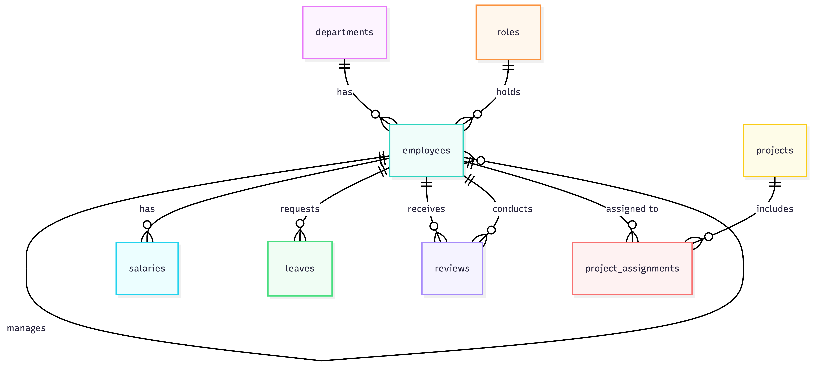

# Design Document

By Aqil

Video overview: https://youtu.be/2oNHhCm3U38

## Scope

I work as a backend developer at an insurance company, and one thing I noticed early on is how much of the internal tooling around people management is either scattered across spreadsheets or handled by clunky third-party software that nobody fully understands. That got me thinking about what a clean, well-structured database for managing employees would actually look like if you built it from scratch with good design in mind.

The database I built is meant to handle everything a company needs to track about its people. That includes who works there, what department they are in, who their manager is, what they get paid, whether they have taken any leave, how their performance has been reviewed, and what projects they are working on. The sample data I used reflects a small tech company based in Baku, Azerbaijan, which is the environment I am most familiar with.

What I deliberately left out is anything that goes beyond the database layer into application territory. So things like actually processing payroll and calculating taxes, tracking recruitment pipelines, managing training programs, or logging daily attendance are all outside the scope. Those are real features a full HR system would have, but they either require external integrations or belong in the application layer rather than the database itself.

## Functional Requirements

Someone using this database should be able to add new employees and record everything about them from the start, their name, contact details, which department they join, what role they hold, and who their manager is. They should also be able to update that information over time as things change, like when someone gets promoted or moves to a different team.

Salary management is handled through a history table rather than a single field, so the database can answer questions like what someone was paid two years ago, not just what they earn today. Leave requests can be submitted and then approved or rejected, and performance reviews can be recorded with a rating and comments after each review cycle. Employees can be assigned to multiple projects at the same time, with a note about what their specific role on that project is.

What is beyond scope is enforcing leave balance limits, which would require tracking how many days each employee has accrued versus used. The database stores the requests but does not block you from submitting one if your balance is zero. That kind of logic belongs in the application, not the database.

## Representation

### Entities

The database has eight tables. Departments and roles are simple lookup tables. Departments store a name and a location, and roles store a job title along with a minimum and maximum salary so there is a defined band for each position. Both use TEXT for their main fields since names and titles are naturally strings, and NUMERIC for the salary columns because decimal precision matters for money.

Employees are the center of everything. Each employee record stores their name, a unique email address which acts as a natural identifier, an optional phone number, their hire date, and their employment status. The status column only allows three values, active, inactive, or terminated, enforced with a CHECK constraint. The most interesting design decision here is the manager field, which is a foreign key that points back to the employees table itself. This lets you represent an org chart of any depth without needing a separate table.

Salaries are stored as a separate history table rather than a single column on the employee record. Each row has an effective date and an end date, and a NULL end date means that salary is currently active. This way nothing gets overwritten when someone gets a raise and you can always query what they were paid at any point in time.

Leaves track requests with a type, a date range, and a status that moves from pending to either approved or rejected. The type and status columns both use CHECK constraints to enforce valid values at the database level rather than relying on the application to get it right.

Reviews store periodic performance evaluations. Each review links to the employee being reviewed and also to the reviewer, who is also an employee since managers are in the same table. The rating is an integer constrained between 1 and 5.

Projects have a name, an optional description, a start date, an optional end date, and a status. The project assignments table connects employees to projects and is a junction table with a composite primary key to prevent anyone being assigned to the same project twice. It also has an optional field for what role the employee plays on that particular project, since someone might be a lead on one project and a contributor on another.

### Relationships

A department can have many employees but each employee belongs to one department. A role can be held by many employees but each employee has one role at a time. An employee can manage many other employees and each employee has at most one direct manager, which is the self-referential relationship that makes the org chart work. An employee has many salary records over time and each salary record belongs to one employee. An employee can make many leave requests and can receive many performance reviews. The project assignments table sits between employees and projects so that many employees can be on many projects at the same time.

## Optimizations

I created indexes on the columns that get filtered most often. The department and role columns on the employees table get queried constantly in reports, so both have indexes. The manager column also has an index because finding all direct reports of a given manager requires joining the table to itself and without an index that becomes a full table scan. The salary table has a compound index on employee ID and end date together because the most common query is finding the current salary of a specific employee, which filters on both columns at once.

Two views make common queries easier. The active employees view joins employees with their department, role, and manager name so you do not have to write that four-table join every time you want a basic employee list. The current salaries view filters salary records to only the active ones and joins in the employee and department names, which covers most compensation reporting needs without any extra work.

## Limitations

The biggest limitation is that salary amounts are stored as raw numbers with no currency, no tax logic, and no deductions. You can see what someone earns but you cannot use this database alone to produce a payslip or calculate what the company owes in employer contributions.

Leave balances are not enforced. The database will happily accept a leave request even if the employee has no days remaining because tracking accrued days versus used days is application logic that would need its own table and rules.

The design is built for a single company. There is no concept of an organization ID anywhere in the schema, so if you wanted to use this for multiple companies you would need to rethink most of the foreign key structure.

Finally, changes to employee records themselves are not audited. If someone moves from Engineering to Finance, the old department is simply overwritten. The salary table has history by design but the employees table does not. A proper audit trail would need either triggers writing to a history table or a separate employee changes log.
